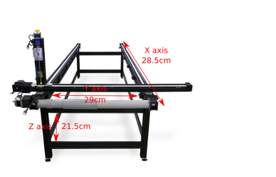
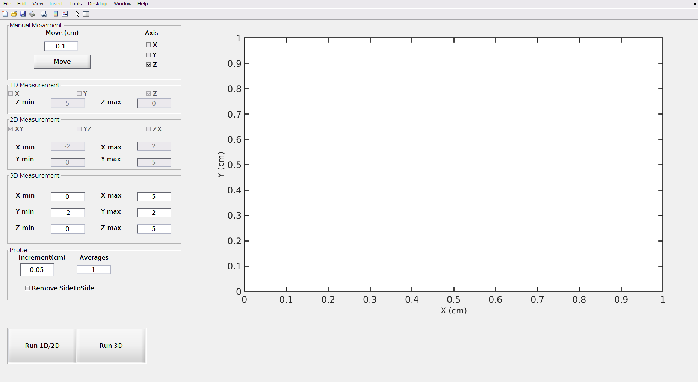
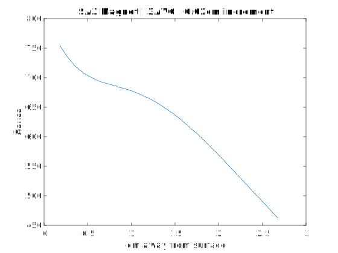

# Magnetic Field Plotter Manual
##### by Devin Morin
##### updated July 2019

## **WARNING**: 
**Careful when moving the probe as to not damage the probe tip. It's recommended that the sample is not in the velmex active area while making some of the larger jog movements to center the probe.**

    
    This image describes the active area of the Velmex system. The active area is the region that the probe can freely move.

**Also, ensure that the probe tip will not hit the sample while performing a measurement.**

## Contents

1. UI Elements
2. How to Measure
3. Further Improvements
4. Data Comparisons
5. Resources

## UI Elements
****

    The above image is the MagFeildMeas.m program. This is used to measure magnetic field in 1D, along either X,Y, or Z; 2D either XY, YZ,  or ZX; or in 3D. All of these measurements have configurable bounds, increment sizes, and number of measurements to average per data point.

Firstly, the program is broken up into two main sections: a measurement column, and plot column. To the left, all data associated with taking the measurement, such as increment size, number of points to average, and ranges for axes will be inputted. The large white box to the right is a graph of the measurements. Here, only the 1D measurements are plotted live, and the 2D measurements plotted after a couple passes of the probe.

In the top left, the '**Data**' tab will store the number of measurements to collect and average per data point. The 'Axis' column has three checkboxes which allow for either X,Y, or Z to be selected. Selecting an axis, and pressing the 'Move' button, will move the probe by an amount that is described in the box under 'Move(cm)'. For example, if the Z axis box is checked, and the move amount is set to 1, the probe will move 1cm in the positive Z direction. It's important to know that the positive Z direction points towards the floor. Check the labels on the Velmex system to find the directions of the axes.

Below the 'Data' tab, is the '**1D Measurement**' tab, which will hold some information needed to take a 1D measurement. Selecting either X,Y, or Z will change the measurement to occur in such an axis. To change the bounds of the measurement, fill in values for 'Z+' (the max position of the probe), and 'Z-' (the min position of the probe). For example, checking the 'Z' axis box, and setting the 'Z-' to -1, and 'Z+' to 5 will make the probe go down 1cm, and measure all the way up to +5cm above it's original position.

In the '**2D Measurement**' tab, selecting either XY, YZ, or ZX will determine the plane that the measurements will take place. As before, setting the min and max position for the given axes will determine the range of the probe. Keep in mind, that compared to 1D measurements, 2D measurements will take significantly longer.

Finally, the '**Probe**' tab will contain the increment size, and a checkbox for 'Remove SideToSide'. The increment size will determine how large of a step between measurements the probe will take. This applies to every axis. So, if the increment size is set to 1mm, and a 3D measurement is taken, the probe will take a step of 1mm on the Y axis, until the Y limit is reached. Then, it takes a step of 1mm on the X, and repeats the Y axis again. When the X axis limit is reached, it then either raises/lowers (depending on the limits set on Z) 1mm, and repeats this process until completed.

### **Describing the 'SideToSide' element**

In the case where the 'Remove SideToSide' box is left unchecked, the probe will move in a back and forth motion along X and Y in order to increase accuracy. Compared to having the box checked, the back and forth motion will greatly increase the total measurement time. 

    Tip: Enabling 'Remove SideToSide' may allow for the probe tip to take measurements in tighter spots, and will greatly decrease acquisition times, at the expense of accuracy.

Since Bx, By, and Bz are each measurement in different locations on the probe tip, in order to allow for all measurements to be taken at the same point in space, the probe will have to move the sensitive area for X towards the center (where the Bz measurement would be taken), then move the By sensitive area to the center. Once all three magnetic field componenets are measured, the probe will move to it's next positon given the increment size.

The sensitive regions for Bx, and By are clearly visible on the Lakeshore Gaussmeter probe tip. The Bx component is labeled with an 'x' on the metalic sensitive region, and the By component is labeled with 'y'.

Comparatively, if the 'Remove SideToSide' box was checked, then the probe would take a measurement of Bx, By, and Bz without moving the probe tip. This means that the only correct value is Bz. Depending on what a measurement is being taken, one axis will be correct, but shifted by 0.208cm, and the other axis will be completely incorrect. This means that magnitude of B will be incorrect, and have magnetic field components that are all incorrect in different ways.

## How to Measure
****
This section will describe how to take a measurement of a sample in the Z direction, with the probe's initial point starting directly above the sample. 

To take a measurement, place the sample underneath the probe tip in the Velmex system. If the probe is off center, realign it by selecting either X, Y, or Z in the axis bar, in the 'Data' tab. Then, insert the amount the probe tip should move by, under 'Move(cm)', and select the 'Move' button. It would be wise to remove the sample in the Velmex system before realigning the probe, as to avoid damaging the probe if you overshoot the target area. Once, X and Y axes are roughly aligned with the probe tip (and Z is corrected if the sample is too large), slowly decrease the height of the probe tip by moving the Z axis. Be careful as to not overshoot the target area as this could damage the probe tip. 

    Tip: According to the 'Velmex Motor Controller Manual', the E01 stepping motor can make an increment of 0.000635cm, so the step size can be quite small in order to get as close to the sample as possible.

Once the probe is in place, fill in a suitable value in the 'Data' tab for 'Averages'. Then, since in this case a 1D measurement is being taken, adjust the 'Z min' and 'Z max' values. If a measurement from the initial probe position, to 5cm above was needed, then Z max should be set to 0, and Z min set to 5. This may seem confusing, but the 'MagFieldMeas' program is set to be the same axis definition set by the Velmex system. As can be seen on the system itself, the axes are defined by labels. The Z axis is vertical, with the negative going upwards, and positive going downwards. In other words, if the probe tip is already touching the surface of a magnet, Z min should be set to the height of the measurement, and Z max set to 0.

Finally, change the increment size in the 'Probe' tab, and select if the 'SideToSide' motion should be disabled. For a detailed explanation behind the 'SideToSide' motion, refer to 1. UI Elements.

## Further Improvements 
****
#### Limit Switches Sticking-
Very rarely, the stepper motor will push the system slightly over the limit switches. This means that when the probe is told by the program to move away from the limit switch, it instantly activates the stop for the motor since it has gone too far over the limit switch. One possible fix to this issue, would be to change the jog rate of the system to a lower value. This would allow for the system to come to a stop before overshooting the limit switches. However, this would lead to much longer acquisition times.

#### Measurements continously being taken while limit switch is pressed-

If measurements are configured to go beyond the active area of the system (active area is defined by the limit switches), then the program will continously take measurements while the probe rests in the same position. Ideally, the system will throw an exception and stop taking measurements once any one of the limit switches is pressed. However, it seems as though the limit switches only communicate to the stepper motor. This means that there is no way to send a signal from the stepper motor to the computer's communication port and break the loop. One way around this problem may be to add a 'try' statement to stop the motor in the middle of the loop. If the stop statement throws an exception, then the limit switch must have been activated during the move statement. If the 'try' statement throws an exception, it should catch a 'break;', and display an error message to terminate the acquisition. 

## Data Comparisons
***

    The above image is a plot of a BA11-3 magnet, with a probe increment of 0.02cm. This plot shows magnitude of magnetic field as the probe tip moves upwards along the Z axis. The probe tip started directly on top of the magnet, and moved to a distance of 6cm. The horizontal data is shifted by the distance from the probe tip, to the sensitive area. (As defined in the manual for this given probe, the tip to sensitive area is about 0.18cm). Three measurements were averaged per data point in order to reduce error.

    The above image is a plot of the SA3 magnet, with an increment size of 0.02cm. Three measurements are taken per data point, and averaged. It can be easily seen that there exists a constant gradient from roughly 1.5cm to 2.5cm.

## Resources
***

## Velmex Stepper Motor Controller Manual

https://www.velmex.com/Downloads/User_Manuals/vxm_user_manl.pdf

## Velmex Stepper Motor Website

https://www.velmex.com/Products/Controls/VXM_Controller.html

## Velmex Driver Install Guides

https://www.ftdichip.com/Support/Documents/InstallGuides.htm

## Lakeshore 460 Gaussmeter Specifications

http://www.sal.wisc.edu/whirc/archive/public/datasheets/lakeshore/460.pdf

## Lakeshore 460 User Manual

http://www.sal.wisc.edu/whirc/archive/public/datasheets/lakeshore/460_Manual.pdf

